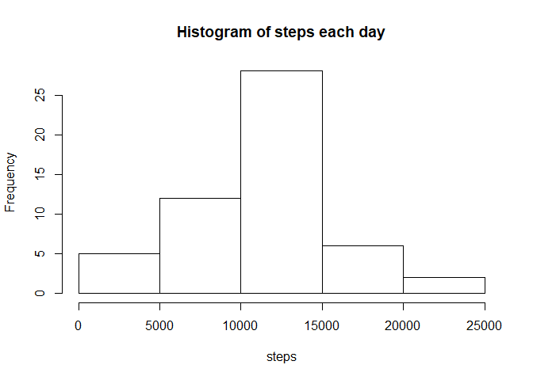
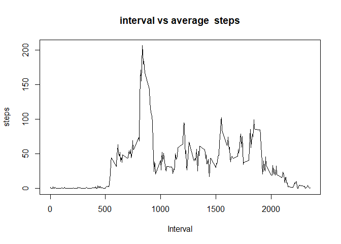
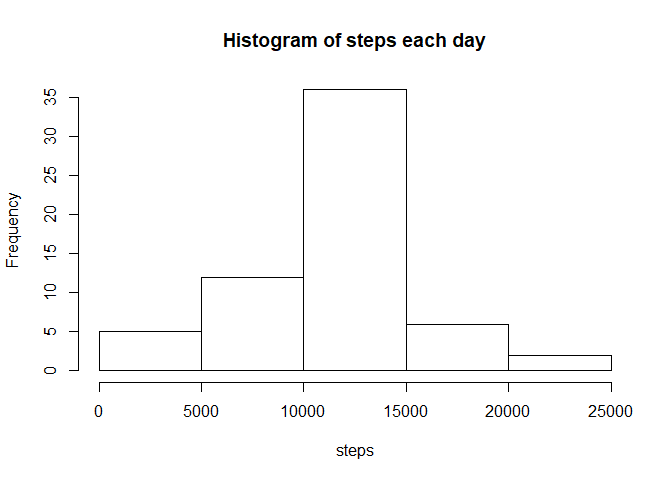
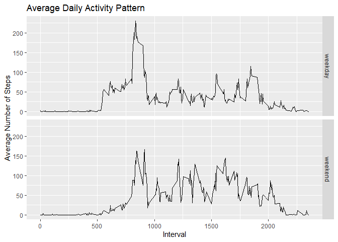

## Loading and preprocessing the data


```r
# Loading the data
# setwd("C:/Users/MOHIT SINGH/Documents/ProgrammingAssignment2/ProgrammingAssignment2/assignment/RepData_PeerAssessment1")
activity <- read.csv("activity.csv")
# Processing the data
activity1<-activity[!is.na(activity$steps),]
activity1<-activity1[!is.na(activity1$date),]
activity1<-activity1[!is.na(activity1$interval),]
# View(activity)
```

## What is mean total number of steps taken per day?

1. Make a histogram of the total number of steps taken each day (NAs ignored)

```r
Allsteps <- aggregate(steps ~ date, activity1, FUN=sum)

hist(Allsteps$steps,main = "Histogram of steps each day",xlab = "steps")
```

<!-- -->

```r
meansteps <- aggregate(steps ~ date, activity1, FUN=mean)
medainsteps <- aggregate(steps ~ date, activity1, FUN=median)
```
2. Calculate and report the mean and median total number of steps taken per day (NAs ignored)

Mean steps taken per day are 37.3825996 and Median steps are 0.

## What is the average daily activity pattern?
1. Make a time series plot (i.e. type = "l") of the 5-minute interval (x-axis) and the average number of steps taken, averaged across all days (y-axis)


```r
Allstepsmean <- aggregate(steps ~ interval, activity1, FUN=mean)
plot(Allstepsmean$interval,Allstepsmean$steps,type = "l",main = "interval vs average  steps",xlab = "Interval",ylab = "steps")
```

<!-- -->

```r
maxIntervam <- Allstepsmean$interval[which.max(Allstepsmean$steps)]
```
2. Which 5-minute interval, on average across all the days in the dataset, contains the maximum number of steps?

Interval 835 contains the maximum number of steps

## Imputing missing values


```r
library(plyr)
```

```
## Warning: package 'plyr' was built under R version 3.6.3
```

```r
NAs <- count(is.na(activity$steps))
NAs <- NAs$freq[2]
```

1. Calculate and report the total number of missing values in the dataset (i.e. the total number of rows with NAs)

There are total 2304 NAs in the data.

2. Devise a strategy for filling in all of the missing values in the dataset. The strategy does not need to be sophisticated. For example, you could use the mean/median for that day, or the mean for that 5-minute interval, etc.

The missing data was filled with the average steps data of same interval.

3. Create a new dataset that is equal to the original dataset but with the missing data filled in.


```r
withMissingDatafilled <- transform(activity,
                              steps = ifelse(is.na(activity$steps),
                                             Allstepsmean$steps[match(activity$interval, 
                                                                        Allstepsmean$interval)],
                                             activity$steps))
```

4. Make a histogram of the total number of steps taken each day and Calculate and report the mean and median total number of steps taken per day. Do these values differ from the estimates from the first part of the assignment? What is the impact of imputing missing data on the estimates of the total daily number of steps?


```r
Allsteps1 <- aggregate(steps ~ date, withMissingDatafilled, FUN=sum)

hist(Allsteps1$steps,main = "Histogram of steps each day",xlab = "steps")
```

<!-- -->

```r
meanSteps <-  mean(Allsteps1$steps)
medianSteps <-  median(Allsteps1$steps)
```

With incarpotation of missing values the frequency of data for each step has increased than that of in first step. Mean steps taken per day are 1.0766189\times 10^{4} and median steps taken per day are 1.0766189\times 10^{4}

## Are there differences in activity patterns between weekdays and weekends?
1. Create a new factor variable in the dataset with two levels – “weekday” and “weekend” indicating whether a given date is a weekday or weekend day.


```r
withMissingDatafilledWW <- transform(withMissingDatafilled,
                              ww = ifelse(weekdays(as.Date(withMissingDatafilled$date))=="Sunday" |weekdays(as.Date(withMissingDatafilled$date))=="Saturday",
                                             "weekend","weekday"))
```
2. Make a panel plot containing a time series plot (i.e. type = "l") of the 5-minute interval (x-axis) and the average number of steps taken, averaged across all weekday days or weekend days (y-axis). The plot should look something like the following, which was creating using simulated data:


```r
meanStepsByDay <- aggregate(steps ~ interval + ww, withMissingDatafilledWW, mean)
library(ggplot2)
```

```
## Warning: package 'ggplot2' was built under R version 3.6.3
```

```r
ggplot(data = meanStepsByDay, aes(x = interval, y = steps)) + 
  geom_line() +
  facet_grid(ww ~ .) +
  ggtitle("Average Daily Activity Pattern") + xlab("Interval") + ylab("Average Number of Steps")
```

<!-- -->


